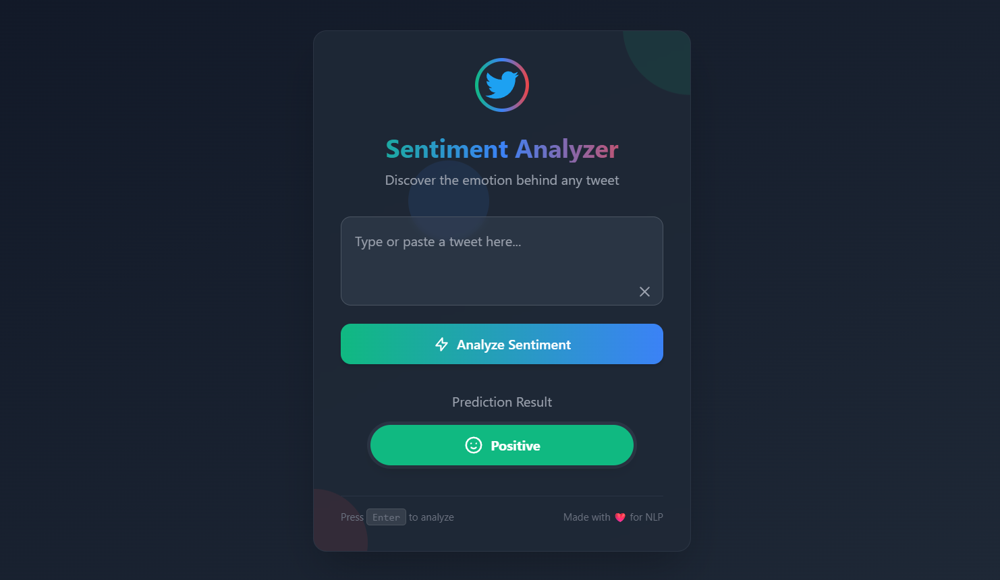

# 🐦 Twitter Sentiment Analysis



A robust NLP pipeline that classifies tweet sentiments (Positive/Negative/Neutral) using machine learning, with a Flask web interface for real-time predictions.

## 📌 Key Features

- **Advanced Text Preprocessing**  
  Cleans tweets by removing URLs, mentions, hashtags, and special characters
- **Model Comparison**  
  Benchmarked Logistic Regression vs. Naive Bayes performance
- **Production-Ready Web App**  
  Flask API with responsive dark-mode UI
- **Comprehensive Evaluation**  
  Detailed classification reports and accuracy metrics

## 📊 Performance Benchmarks

### Logistic Regression (Best Model)
| Class      | Precision | Recall | F1-Score | Support |
|------------|-----------|--------|----------|---------|
| Negative   | 0.82      | 0.87   | 0.84     | 266     |
| Neutral    | 0.87      | 0.79   | 0.83     | 285     |
| Positive   | 0.84      | 0.87   | 0.86     | 277     |
| **Accuracy** |           |        | **0.84** | 828     |

### Naive Bayes
| Class      | Precision | Recall | F1-Score | Support |
|------------|-----------|--------|----------|---------|
| Negative   | 0.69      | 0.83   | 0.76     | 266     |
| Neutral    | 0.81      | 0.59   | 0.68     | 285     |
| Positive   | 0.77      | 0.82   | 0.79     | 277     |
| **Accuracy** |           |        | **0.75** | 828     |

## 🚀 Quick Start

### Prerequisites
- Python 3.8+
- pip

### Installation
```bash
git clone https://github.com/yourusername/twitter-sentiment.git
cd twitter-sentiment
python -m venv .venv

# Activate Virtual Environment
source .venv/bin/activate  # Linux/Mac
.venv\Scripts\activate     # Windows

pip install -r requirements.txt
```